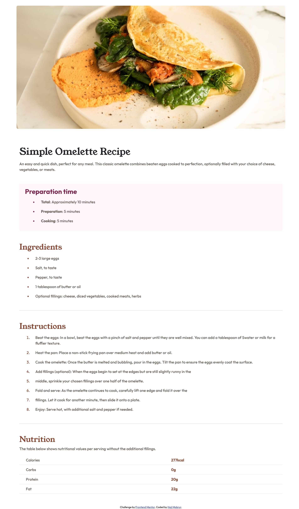
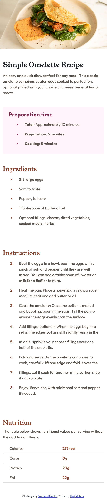

`# Frontend Mentor - Recipe page solution

This is a solution to the [Recipe page challenge on Frontend Mentor](https://www.frontendmentor.io/challenges/recipe-page-KiTsR8QQKm). Frontend Mentor challenges help you improve your coding skills by building realistic projects. 

## Table of contents

- [Overview](#overview)
  - [The challenge](#the-challenge)
  - [Screenshot](#screenshot)
  - [Links](#links)
- [My process](#my-process)
  - [Built with](#built-with)
  - [What I learned](#what-i-learned)
  - [Continued development](#continued-development)
  - [Useful resources](#useful-resources)
- [Author](#author)
- [Acknowledgments](#acknowledgments)

**Note: Delete this note and update the table of contents based on what sections you keep.**

## Overview

### Screenshot

- Dekktop-preview 
- Mobile-preview 

### Links

- Solution URL: [Add solution URL here]([https://your-solution-url.com](https://www.frontendmentor.io/solutions/recipe-page-website-using-bootstrap-framework-O2aLeRkHMY))
- Live Site URL: [Add live site URL here]([https://your-live-site-url.com](https://simatg.github.io/recipe-page/))

## My process

### Built with
- Semantic HTML5 markup
- CSS custom properties
- Flexbox
- [Bootstrap](https://getbootstrap.com/) - CSS Framework

### What I learned

This is my first project using bootstrap, i am still learning to provide a better website soon.

## Author

- Frontend Mentor - [@SimatG](https://www.frontendmentor.io/profile/SimatG)
- Instagram - [@hajimabrurr_](https://www.instagram.com/hajimabrurr_)
- Github - [@SimatG](https://github.com/SimatG)
